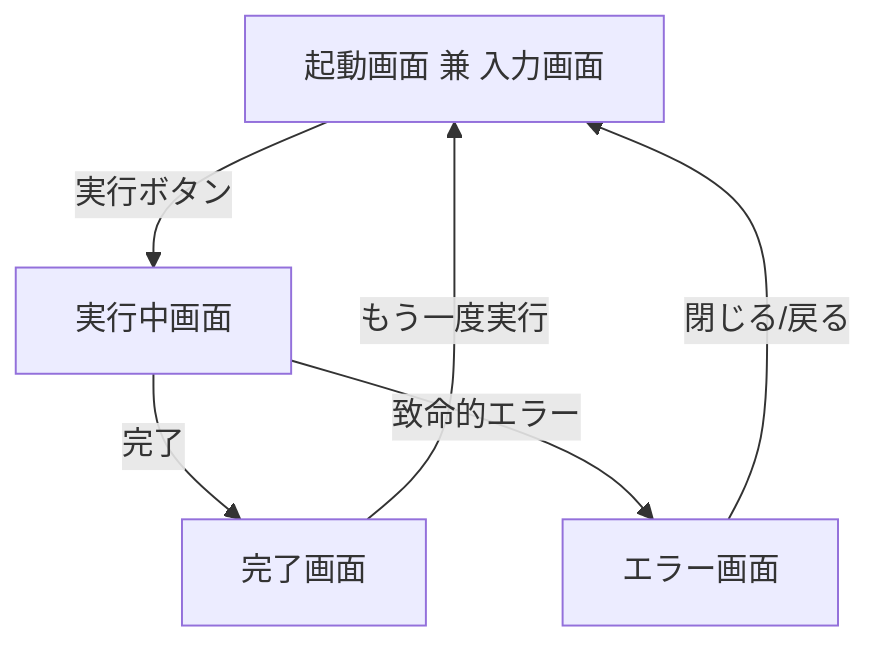
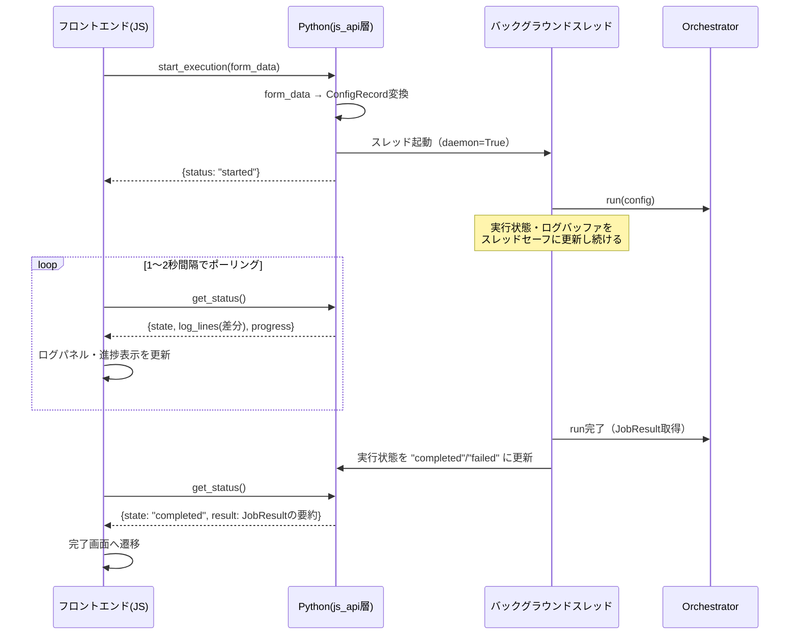
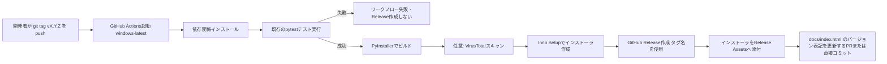
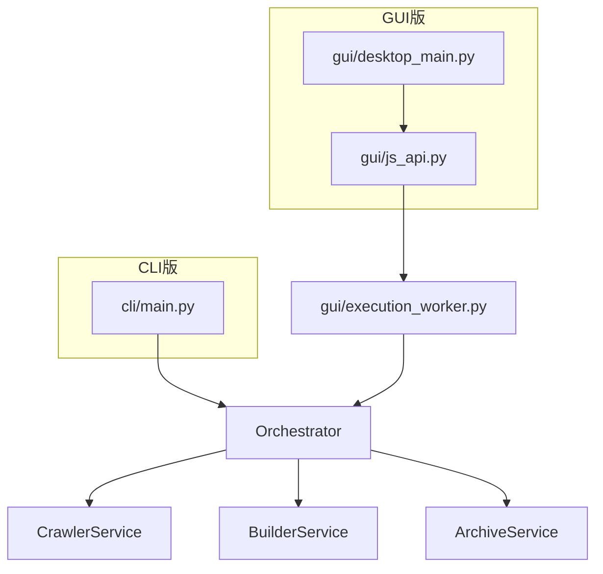

# 08_デスクトップアプリ化要件定義書

## 0. 本書の位置づけ

- 本書は「NotebookLM_Document_Crawler_要件定義書.md」（以下「基本要件定義書」）で定義されたクロール・ビルド機能を前提とし、これをDocker Compose環境から**一般ユーザ向けWindowsデスクトップアプリケーション**として配布するための追加要件を定義する。
- 基本要件定義書・02〜07の各設計書で定義済みの内部ロジック（クロール・差分判定・ビルド・アーカイブ）そのものの仕様変更は行わない。本書が扱うのは、①GUI層の追加、②実行環境の変化（Docker→exeインストーラ）に伴うデータ保存先・実行方式の変更、③配布・CI/CDの追加、の3点である。
- 本書の決定事項は、既存の設計協議（4項目の意思決定：コード署名要否・データ保存先・非同期実行方式・CI/CDトリガー）を反映したものである。決定の経緯は9節「設計決定記録」を参照。

---

## 1. 概要・目的

Python製のクローラー本体（`src/app/`）とHTML/CSS/JSによる簡易なGUIを1つのWindows用インストーラにまとめ、一般ユーザが以下の操作のみでツールを利用できるようにする。

1. インストーラを実行してアプリをインストールする
2. アプリを起動する（Web画面がネイティブウィンドウとして開く）
3. 対象URL等の必要項目を入力し、「実行」ボタンを押す
4. 進捗を画面上で確認しながら待つ
5. 完了後、生成された成果物（`output/`配下）をNotebookLMへアップロードする

Docker・コマンドライン操作の知識を前提としない利用者を主対象とする。

---

## 2. スコープ

### 対象範囲

- GUIフレームワークによる入力画面・実行画面の実装
- 既存クローラー本体（Orchestrator以下）とGUI層の連携
- データ保存先のデスクトップアプリ向け変更
- PyInstallerによるexe化
- Inno Setupによるインストーラ作成
- GitHub Actionsによるタグpush起点のビルド・リリース自動化
- GitHub Pagesによる配布ランディングページ

### 対象外（将来拡張候補として明記するが本書のスコープには含めない）

- コード署名（9節参照。本要件では非対応と明確に決定する）
- 自動アップデート機能（差分更新・起動時チェック含む）
- macOS / Linux版の提供
- 実行中キャンセル機能（GUI-3。将来拡張候補として設計上は考慮するが、初期リリースでは非対応）
- Portable版（zip配布）の提供

---

## 3. GUIフレームワーク

| 項目 | 内容 |
|---|---|
| 採用フレームワーク | **PyWebView** |
| 理由 | Windows 10/11に標準搭載されるEdge WebView2ランタイムを利用するため、Chromeの追加インストールが不要。ウィンドウ制御（サイズ・タイトル・最小化）もEelより柔軟 |
| フロントエンド技術 | HTML / CSS / 素のJavaScript（フレームワーク不使用。画面規模が小さいため） |
| Python⇔JS連携方式 | PyWebViewの`js_api`機構を使用し、Python側のクラスメソッドをJSから`pywebview.api.<method>()`として呼び出す |

---

## 4. 画面構成・入力項目

### 4.1 画面構成（初期リリース）



- 1画面内でセクション切り替え（SPA的な表示制御）とし、別ウィンドウは開かない。
- 「実行中画面」では入力欄を無効化し、二重実行を防止する（多重起動防止はアプリプロセス単位でも別途行う。7節参照）。

### 4.2 入力項目

| 項目 | 表示区分 | 対応する設定 | 備考 |
|---|---|---|---|
| 対象URL | 基本 | `url` / `base_urls` | テキストエリア形式。1行1URLとし、1行のみなら単一サイト処理、複数行なら複数サイト処理として扱う（`ConfigRecord`の`url`/`base_urls`にそのままマッピングできるため、GUI側の実装コストが小さい） |
| モード（差分更新／全件取得） | 基本 | `MODE` | ラジオボタン。既定値`incremental` |
| 詳細設定（折りたたみ） | 詳細 | `WORD_LIMIT` / `REQUEST_DELAY` / `INCLUDE` / `EXCLUDE` / `MAX_PAGES` / `TIMEOUT_SECONDS` | 既定値を入れた状態で開き、変更しなければDocker版と同じ挙動になるようにする |
| 出力先フォルダ | 詳細（任意） | 8節参照 | 既定はユーザーフォルダ直下。変更した場合のみ上書き |
| ログレベル | 詳細 | `LOG_LEVEL` | 既定`INFO` |

`--manifest`によるmanifest.json個別指定は上級者向けCLI機能として位置づけ、GUIでは提供しない（基本要件定義書・07_CLI仕様のCLI版でのみ利用可能とする）。

### 4.3 設定値の永続化

- 前回入力値（URL・モード・詳細設定）は、8節で定義するユーザーデータフォルダ配下に`settings.json`として保存し、次回起動時に復元する。
- 保存・復元処理はPython側で行い、起動時に`js_api`経由でJSへ渡す。

---

## 5. 実行方式（非同期実行・ポーリング型ログ取得）

### 5.1 決定事項

- **Python側の実行は非同期（バックグラウンドスレッド）とする。**
- **進捗・ログの取得はJS側からのポーリングによる。** Python側からJSへのプッシュ通知は行わない。

### 5.2 理由

- PyWebViewはJS→Pythonの同期呼び出しに最適化されており、Python→JSへの逆方向通知（`evaluate_js`によるプッシュ）は実装が複雑になりやすく、環境によって不安定になることがある。
- ポーリング方式であれば、Python側は「現在の状態と直近のログ」を返すだけのシンプルな関数を1つ公開するだけでよく、実装・保守コストが低い。
- 数百〜数千ページを処理する本ツールの性質上、ログの反映に1〜2秒程度の遅延があっても実用上問題ない。

### 5.3 処理シーケンス



### 5.4 `get_status()` の返却仕様

| フィールド | 型 | 説明 |
|---|---|---|
| `state` | str | `idle` / `running` / `completed` / `failed` |
| `log_lines` | List[str] | 前回ポーリング以降に追加されたログ行（差分のみ返却し、通信量を抑える） |
| `current_site` | Optional[str] | 現在処理中のサイト識別子 |
| `sites_done` | int | 処理完了済みサイト数 |
| `sites_total` | int | 対象サイト総数 |
| `result_summary` | Optional[dict] | `state=completed`時のみ。`BuildResultRecord`一覧を要約したもの |
| `exit_code` | Optional[int] | `state=completed`/`failed`時のみ。07_CLI仕様の終了コード（0/1/2）と同じ意味 |

- ログ行の取り違え・重複防止のため、Python側はログバッファに連番インデックスを付与し、JS側は最後に受け取ったインデックスを次回リクエストに含める（`get_status(since_index)`）。

### 5.5 ログ連携の実装方針

- `logging`モジュールに独自の`Handler`（例：`InMemoryLogHandler`）を追加し、`logs/crawler.log`への書き込みと同時にスレッドセーフなリングバッファへログを蓄積する。
- 06_処理シーケンス.mdで定義済みのログ出力箇所（Downloaded / Warning / Error等）はそのまま活用でき、GUI用の特別なログ出力コードを別途実装する必要はない。

---

## 6. キャンセル機能（将来拡張・初期リリース対象外）

- 初期リリースでは実行開始後のキャンセルは提供しない。
- 将来対応する場合は、`CrawlerService`のクロールループに中断フラグのチェックを追加し、「現在処理中のページ完了を待って安全に中断」する設計とする（06_処理シーケンス.mdのアトミック書き込み・マージ更新ルールと整合させ、中断時にmanifest等が破損しないようにするため）。

---

## 7. 多重起動防止

- アプリプロセス単位で1インスタンスのみ許可する。Windows名前付きMutexを起動時に取得し、取得できない場合は既存ウィンドウをアクティブ化して新規起動を中止する。
- サイト単位のロック（06_処理シーケンス.md 9節）と役割が異なる点に注意：本項はアプリ自体の二重起動（ポート競合・ログ競合）を防ぐものであり、既存のサイト単位ロックはそのまま維持する。

---

## 8. データ保存先設計

### 8.1 決定事項

**ルートパスはユーザーフォルダ直下とする。**

```
%USERPROFILE%\NotebookLMCrawler\
├── cache\
│   └── {site_identifier}\...
├── output\
│   └── {site_identifier}\...
├── archives\
│   └── {site_identifier}\...
├── logs\
│   └── crawler.log
└── settings.json
```

- 03_ディレクトリ構成.mdで定義済みの`cache/`・`output/`・`archives/`・`logs/`の内部構造（サイト識別子単位の分離等）はそのまま維持し、ルートパスの決定方法のみをDocker版から変更する。
- `%USERPROFILE%`直下を採用する理由：エクスプローラーでの視認性が高く、成果物（`output/`）を手動でNotebookLMへアップロードする一般ユーザにとって、`%LOCALAPPDATA%`等の隠しフォルダより発見しやすいため。

### 8.2 出力先フォルダの変更（任意機能）

- 詳細設定にて、`output/`の保存先のみユーザーが変更できるオプションを提供する（優先度：低。初期リリースでは既定パス固定でも可とし、要望に応じて追加する）。

### 8.3 インストール先・権限方針

- データ保存先をユーザーフォルダ直下とする方針と一貫させるため、**アプリ本体のインストール先も管理者権限を要求しないユーザーインストール（per-user install）とする。**
- Inno Setupの`PrivilegesRequired=lowest`を用い、既定のインストール先を`{localappdata}\Programs\NotebookLMCrawler`とする。
- これにより、UACプロンプトを経由せずインストール・実行が可能になり、9節で決定した「コード署名なし」の運用とも整合する（署名なしの管理者権限インストーラは、より強い警告が表示される傾向があるため）。

### 8.4 アンインストール時の挙動

- アンインストーラはインストールしたアプリ本体（exe・付随ファイル）のみを削除し、8.1のユーザーデータフォルダ（`cache/`・`output/`・`archives/`・`logs/`・`settings.json`）は削除しない。
- クロール成果物やキャッシュを誤って失うリスクを避けるための決定である。

---

## 9. 設計決定記録（Decision Log）

| ID | 決定事項 | 内容 |
|---|---|---|
| DIST-1 | コード署名 | **不要**。署名なしで配布する。SmartScreen警告が表示される旨、および回避手順（「詳細情報」→「実行」）を配布ページ・READMEに明記する（13節参照） |
| DATA-1 | データ保存先ルートパス | `%USERPROFILE%\NotebookLMCrawler\`（ユーザーフォルダ直下）。`%LOCALAPPDATA%`は採用しない |
| GUI-2 | 非同期実行・進捗表示 | バックグラウンドスレッドで非同期実行し、JS側が`get_status()`を1〜2秒間隔でポーリングしてログ・進捗を取得する。Pythonからのプッシュ通知は行わない |
| DIST-3 | CI/CDトリガー | `git tag`のpushを起点に、ビルド・GitHub Release作成・アセット添付まで全自動化する |
| GUI-1 | GUIフレームワーク | PyWebView（Eelは不採用） |
| GUI-4 | 多重起動防止 | Mutexによるアプリ単位の単一インスタンス制御を行う |
| GUI-6 | 設定値の永続化 | `settings.json`に前回入力値を保存し次回起動時に復元する |
| DATA-3 | exe生成方式 | PyInstaller `--onedir`（フォルダ形式）を採用し、Inno Setupでラップすることでユーザーに提示される最終成果物は単一のインストーラexeとする |
| DIST-2 | ウイルス対策誤検知対応 | 必須ではないが、CI上でVirusTotal等による事前スキャンを行い結果をリリースノートに記載することを推奨する（12節参照） |
| DIST-4 | 配布形態 | インストーラ(.exe)のみ。Portable版(zip)は将来拡張候補 |
| DIST-5 | GitHub Pagesの役割 | 最新リリースへのダウンロードリンクを持つシンプルな静的ランディングページ1枚のみ |
| DIST-6 | Pagesのソース | `docs/`フォルダ（mainブランチ）をPages公開元とする |
| DIST-7 | 自動アップデート | 初期リリースでは実装しない（将来拡張候補） |
| DIST-8 | バージョニング | Semantic Versioning（`vX.Y.Z`形式のGitタグ）を採用し、exeのFileVersion/ProductVersionにも反映する |
| INT-1 | 既存コードとの統合 | 既存の`Orchestrator`・`CrawlerService`等（`src/app/`配下）をそのまま流用する。GUI層は`src/app/gui/`として新設し、入出力の橋渡しに専念する |
| INT-3 | エラー通知 | GUI上にエラーダイアログ／トースト通知を表示する。詳細情報は`logs/crawler.log`を確認するよう案内する |

---

## 10. アプリケーション構成

```
project/
├── .github/
│   └── workflows/
│       └── release.yml
├── web/                        # フロントエンド資産（PyInstallerで同梱）
│   ├── index.html
│   ├── css/
│   │   └── style.css
│   └── js/
│       └── main.js
├── src/
│   ├── main.py                 # CLIエントリポイント（既存。03_ディレクトリ構成準拠）
│   └── app/
│       ├── gui/                 # 【新設】GUI層
│       │   ├── __init__.py
│       │   ├── desktop_main.py  # PyWebViewの起動、ウィンドウ生成
│       │   ├── js_api.py        # JSに公開するAPIクラス（start_execution/get_status等）
│       │   ├── execution_worker.py  # バックグラウンドスレッド管理
│       │   ├── log_buffer.py    # スレッドセーフなリングバッファ + logging.Handler
│       │   └── user_paths.py    # 8節のデータ保存先解決（%USERPROFILE%配下）
│       ├── cli/                 # 既存（CLI版）
│       ├── config/ crawler/ builder/ archive/ service/ models/ mapper/ repository/ utils/ exceptions/
│       │                        # 既存。変更なし（INT-1）
│       └── ...
├── requirements.txt
├── requirements-desktop.txt     # pywebview等、デスクトップアプリ限定の追加依存
├── main.spec                    # PyInstallerのビルド定義ファイル
├── installer.iss                # Inno Setupのインストーラ定義ファイル
├── docker-compose.yml           # 既存（Docker版はそのまま維持）
└── docs/                        # GitHub Pages公開元（DIST-6）
    └── index.html                # ダウンロードランディングページ
```

- Docker Compose版（CLI）とデスクトップアプリ版（GUI）は共存させる。既存の`docker-compose.yml`・`src/main.py`（CLIエントリポイント）はそのまま維持し、`src/app/gui/`を追加する形とする。

---

## 11. パッケージング（PyInstaller）

| 項目 | 内容 |
|---|---|
| ビルド方式 | `--onedir`（8.1節DATA-3の決定に基づく） |
| エントリポイント | `src/app/gui/desktop_main.py` |
| 静的ファイル同梱 | `--add-data "web;web"` により`web/`配下（HTML/CSS/JS）を同梱する |
| コンソール非表示 | `--noconsole` を指定し、実行時にコマンドプロンプトを表示しない |
| バージョン情報埋め込み | Windows実行ファイルのFileVersion/ProductVersionに、Gitタグから取得したバージョン番号を埋め込む（`.spec`ファイルの`version`パラメータで指定） |

```
pyinstaller --noconsole --onedir --add-data "web;web" ^
  --name NotebookLMCrawler ^
  --version-file version_info.txt ^
  src/app/gui/desktop_main.py
```

---

## 12. インストーラ（Inno Setup）

| 項目 | 内容 |
|---|---|
| インストール先 | `{localappdata}\Programs\NotebookLMCrawler`（8.3節、管理者権限不要） |
| `PrivilegesRequired` | `lowest`（UACプロンプトを経由しない） |
| デスクトップショートカット | 作成する（インストール時にオプションとして選択可能） |
| スタートメニュー登録 | 行う |
| アンインストーラ | Inno Setup標準機能により自動生成。8.4節の通りユーザーデータは削除対象外 |
| バージョン表示 | インストーラ自体のプロパティ、およびアプリの「バージョン情報」画面にGitタグ由来のバージョンを表示する |

---

## 13. コード署名・SmartScreen対応

- 9節DIST-1の決定通り、**コード署名は行わない**。
- 配布ページ（`docs/index.html`）およびREADMEに、以下の内容を明記する：
  - 「このアプリは個人開発のオープンソースツールであり、コード署名証明書を取得していません」
  - 「初回実行時にWindows SmartScreenの警告が表示される場合があります。『詳細情報』→『実行』を選択してください」
  - GitHubリポジトリへのリンク（ソースコードが公開されていることを明示し、信頼性の裏付けとする）

---

## 14. ウイルス対策誤検知対応（推奨・任意）

- PyInstaller製の未署名exeは、一部のウイルス対策ソフトで誤検知されることがある。
- 必須要件ではないが、GitHub Actions上でビルド後にVirusTotal API等を用いた事前スキャンを行い、結果へのリンクをリリースノートに記載することを推奨する。
- 誤検知が疑われる場合の問い合わせ先（GitHub Issues等）をREADMEに明記する。

---

## 15. バージョニング

- Semantic Versioning（`vX.Y.Z`）形式のGitタグを正とする。
- タグpush時に、以下へ同一バージョン番号を反映する：
  - GitHub Releaseのタイトル・タグ名
  - PyInstallerで生成されるexeのFileVersion/ProductVersion
  - Inno Setupインストーラの`AppVersion`
  - `docs/index.html`（配布ページ）に表示する最新バージョン番号

---

## 16. CI/CD（GitHub Actions）

### 16.1 決定事項

**`git tag` のpushを起点として、ビルド・テスト・GitHub Release作成・インストーラのアセット添付までを全自動化する。**（9節DIST-3）

### 16.2 全体フロー



### 16.3 ワークフロー定義案（`.github/workflows/release.yml`）

```yaml
name: Build and Release Windows Installer

on:
  push:
    tags:
      - 'v*.*.*'

jobs:
  build-windows:
    runs-on: windows-latest

    steps:
      - name: Checkout repository
        uses: actions/checkout@v4

      - name: Set up Python
        uses: actions/setup-python@v5
        with:
          python-version: '3.12'

      - name: Install dependencies
        run: |
          python -m pip install --upgrade pip
          pip install -r requirements.txt
          pip install -r requirements-desktop.txt
          pip install pyinstaller pytest

      - name: Run tests
        run: pytest tests/

      - name: Extract version from tag
        id: version
        shell: bash
        run: echo "version=${GITHUB_REF_NAME#v}" >> "$GITHUB_OUTPUT"

      - name: Build EXE with PyInstaller
        run: |
          pyinstaller --noconsole --onedir --add-data "web;web" `
            --name NotebookLMCrawler src/app/gui/desktop_main.py

      - name: Compile Installer with Inno Setup
        uses: minicomp/iscc-action@v1
        with:
          iss_file: installer.iss
        env:
          APP_VERSION: ${{ steps.version.outputs.version }}

      - name: Create GitHub Release and upload asset
        uses: softprops/action-gh-release@v1
        with:
          files: Output/NotebookLMCrawlerSetup.exe
          generate_release_notes: true
        env:
          GITHUB_TOKEN: ${{ secrets.GITHUB_TOKEN }}
```

- 元のGemini案（`on: release: types: [created]`）から、`on: push: tags:` に変更している点が本要件との主要な差分である。この変更により「先に手動でReleaseを作成する」手順が不要になり、タグをpushするだけで一連の処理が完結する。
- リリースノートは`generate_release_notes: true`によりコミットログから自動生成する（将来的に手動編集へ変更することも可能）。

---

## 17. GitHub Pages（配布ランディングページ）

- 公開元：`docs/`フォルダ（mainブランチ、9節DIST-6）
- 内容：シンプルな単一HTMLページ。以下を含む：
  - アプリ名・簡単な説明
  - 「最新版をダウンロード」ボタン（GitHub Releasesの`latest`エイリアスURLへリンク：`https://github.com/{owner}/{repo}/releases/latest/download/NotebookLMCrawlerSetup.exe`）
  - 13節のSmartScreen注意書き
  - GitHubリポジトリへのリンク
- ページ自体の自動更新（バージョン番号表記等）は必須要件とはしない。将来的にCIから自動反映することも可能（16.2節の点線部分）。

---

## 18. 自動アップデート（対象外・将来拡張候補）

- 初期リリースでは実装しない。
- 将来的に対応する場合、起動時にGitHub Releases APIで最新バージョンを取得し、現在のバージョンと比較して通知のみ行う方式（差分自動更新は行わない）を優先候補とする。

---

## 19. 既存資産との統合方針

- `Orchestrator` / `CrawlerService` / `BuilderService` / `ArchiveService`等（`src/app/`配下、02〜07で設計・実装済み）は変更しない。
- GUI層（`src/app/gui/`）は、①フォーム入力から`ConfigRecord`を組み立てる、②非同期実行を管理する、③ログバッファを提供する、④8節のパス解決を行う、の4点にのみ責務を持つ。
- CLI版（`src/app/cli/`）とGUI版で処理ロジックの二重実装が発生しないよう、両者は共通のOrchestratorを呼び出す構成とする。



---

## 20. エラーハンドリング・通知

- Python側で捕捉した例外（`ConfigError`等）は`get_status()`の`state=failed`および付随メッセージとしてJSへ返却する。
- JS側はエラー内容をダイアログ／トースト通知として表示し、詳細は「ログを開く」ボタン経由で`logs/crawler.log`（8.1節のパス）をエクスプローラーで開けるようにする。
- Orchestratorレベルの終了コード（0/1/2、07_CLI仕様準拠）は、GUI上でも同じ意味で扱う：0=完了（成功表示）、1=実行前エラー（設定不備等）、2=一部サイト失敗（警告表示だが完了扱い）。

---

## 21. 非機能要件

| 項目 | 内容 |
|---|---|
| 対応OS | Windows 10 / 11（64bit）。WebView2ランタイムは標準搭載前提とし、別途インストール手順は用意しない |
| 権限 | 管理者権限不要（8.3節） |
| 起動時間 | `--onedir`形式採用によりonefile形式より高速な起動を優先する（具体的な秒数目標は本書では定めない） |
| ディスク容量 | インストーラ・アプリ本体は既存のCLI版依存ライブラリ（trafilatura等）を含むため数百MB程度になる見込み。数値目標は定めないが、READMEに目安を明記する |
| 同時実行数 | 1インスタンスのみ（7節） |
| ネットワーク | クロール対象サイトへのHTTPS通信のみ。テレメトリ・使用状況の外部送信は行わない |

---

## 22. 今後の課題

- キャンセル機能（6節）・自動アップデート（18節）は将来拡張として本書に明記したが、優先度・実装時期は未定である。
- VirusTotalスキャン（14節）の具体的なCIステップ（APIキー管理含む）は本書では詳細化しておらず、実装時に別途設計が必要である。
- 出力先フォルダ変更オプション（8.2節）は優先度「低」としたが、実際の利用者フィードバックを踏まえて優先度を再検討することを推奨する。
- macOS/Linux版は対象外としたが、要望が多い場合はPyWebViewの互換性を活かして展開できる可能性がある（Inno Setup部分は別途OS別対応が必要）。
