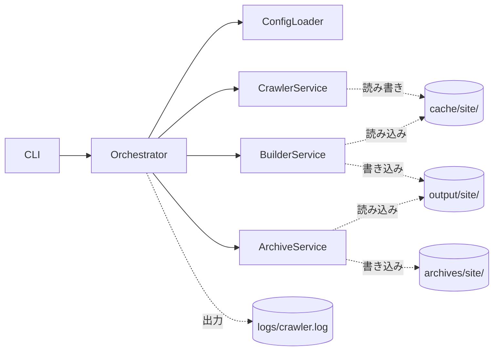

# 02_基本設計書

## 0. 本書について

- **目的**：本書は「NotebookLM Document Crawler」の基本設計を統合し、実装者・レビュアが全体像を俯瞰できるようにすることを目的とする。
- **位置づけ**：本書は「03_ディレクトリ構成」「04_モジュール設計」「05_データ構造設計」「06_処理シーケンス」「07_CLI仕様」の要点を統合した上位ドキュメントである。各成果物の詳細な仕様（API署名・クラス図・全フィールド定義・全シーケンス図等）はそれぞれの原本を正とし、本書では重複転記しない。本書が扱うのは、①全体像の提示、②成果物間の整合性確保、③本プロジェクトで行った重要な設計判断の記録、の3点である。
- **対象読者**：本ツールの実装者を主読者とする。クラス図・シーケンス図・DTO定義など実装レベルの詳細を含む。
- **読み方**：まず本書で全体像と設計判断の経緯を把握した上で、実装対象に応じて該当する原本（03〜07）を参照することを推奨する。

---

## 1. システム概要

Webサイト上のドキュメントを収集・整形し、NotebookLMへアップロードしやすいMarkdownファイル群を生成するツールである。Supabase Docsに限らず、React・Next.js・Cloudflare・Stripe・AWSなど一般的なドキュメントサイト全般で利用できる汎用ツールとして設計する。Docker Composeのみで、Windows環境でも `docker compose up` だけで実行できることを目標とする（要件定義書1〜2節）。

### 設計方針（要件定義書38節を踏まえた全体方針）

- NotebookLMへの投入品質を最優先する
- ドキュメントサイトに依存しない汎用設計とする（ただしSPAは対象外）
- 差分更新を高速化する（ダウンロード・パースは差分のみ／結合は常に全件再構築）
- サーバーへの負荷を最小限にする
- NotebookLMだけでなくRAG用途にも流用可能とする
- Docker Composeのみで簡単に実行できることを重視する

---

## 2. 全体アーキテクチャ



サブモジュール単位の依存関係図・クラス図は「04_モジュール設計」6節を参照。

### パッケージレイアウト（概要）

```
src/
├── cli/        ... CLI引数解析とエントリポイント
├── config/     ... ConfigLoader / ConfigRecord
├── service/    ... Orchestrator / 各Service（オーケストレーションのみ）
├── crawler/    ... サイト探索・取得・抽出・差分判定
├── repository/ ... JSON読込保存（具体実装）
├── mapper/     ... JSON ⇔ DTO変換
├── dto/        ... DTO定義（dataclass）
├── builder/    ... Markdown結合・チャンク化・Index生成・重複解決・ZIP起点
├── archive/    ... ZIP生成とアーカイブ保存
├── utils/      ... 共通ユーティリティ
└── exceptions/ ... ドメイン例外
```

詳細は「04_モジュール設計」3〜4節を参照。

---

## 3. 各成果物のサマリーと参照

| 成果物 | 内容の要約 |
|---|---|
| **03_ディレクトリ構成** | `cache/` ・`output/` ・`archives/` ・`logs/` をサイト識別子単位で分離する構成を定義。サイト識別子はURLから機械的・再現可能に生成する（小文字化・記号の`_`置換）。末尾スラッシュ有無の違いは同一識別子に正規化され、これは仕様として扱う。 |
| **04_モジュール設計** | `cli` / `config` / `service` / `crawler` / `repository` / `mapper` / `dto` / `builder` / `archive` / `utils` / `exceptions` のパッケージ構成と、各クラスの責務・公開APIを定義。Single Responsibility・DTO Only・Repository集約などの設計原則に基づく。 |
| **05_データ構造設計** | `manifest.json`（差分管理専用、ビルドには使わない）と `metadata/{page_hash}.json`（ビルド用詳細情報）を分離管理する方針を定義。DTOは全て `frozen=True` の Immutable とし、JSON変換はMapper層に集約する。重複判定はmanifestに保持せず、Builderが毎回全件照合する。 |
| **06_処理シーケンス**（本プロジェクトで新規作成） | 逐次処理を前提とした全体フロー・差分判定・フォールバッククロール・ビルド・エラー処理・Resumeの6種のシーケンス図を定義。あわせて04⇔05のDTO不整合の読み替え、削除ページ判定の網羅性ガード、アトミック書き込み・ファイルロック方式を新たに定義した。 |
| **07_CLI仕様**（本プロジェクトで新規作成） | CLI引数・`.env`環境変数・引数バリデーション・3段階の終了コード・ログ出力仕様を定義。要件定義書36節の「CLIから変更可能な項目」の範囲を維持しつつ、`LOG_LEVEL`等の運用補助項目を新たに正式化した。 |

---

## 4. 設計決定記録（Design Decision Log）

要件定義書には明記がなく、本プロジェクトの設計協議で確定した事項を一覧化する。各IDの詳細な論点・選択肢・理由は協議ログを参照し、本表は決定内容の要約とする。

| ID | 決定事項 | 採用した方針 |
|---|---|---|
| INT-1 | 04⇔05のDTO不整合の解消方針 | 05を正とし、`PageRecord`は使用せず一時オブジェクト`CrawlPageResult`を新設。`BuildResultRecord`/`SiteContextRecord`を新規定義（06_処理シーケンス 1節） |
| CLI-1 | CLI引数の範囲 | 要件36節の範囲（URL・`--manifest`）を堅持し、`--log-level`等の運用補助フラグのみ追加 |
| CLI-2 | 終了コード設計 | 3段階（0=成功／1=致命的エラー／2=部分的失敗） |
| CLI-3 | 複数サイト処理時の`--manifest`禁止判定 | `BASE_URLS`経由かどうかという経路ベースで判定（件数に依存しない） |
| CLI-4 | `--manifest`の上書き範囲 | manifest.jsonのパスのみ上書き。`pages/`・`metadata/`は常に標準構成 |
| CLI-5 | ログのコンソール出力 | コンソール・ファイル両方に同一内容を出力 |
| CLI-7 | `LOG_LEVEL`/`LOG_FORMAT`/`LOG_FILE_PATH` | `.env`の正式項目として追加（デフォルト値あり） |
| SEQ-1 | ページ取得の並行性 | 逐次処理（並列化しない） |
| SEQ-2 | 複数サイト処理の並行性 | サイト単位で逐次処理 |
| SEQ-3 | 1サイトあたりの処理単位 | クロール→ビルド→アーカイブを1サイトごとに完結させる |
| SEQ-4 | MAX_PAGESのsitemapモードでの扱い | 警告ログのみ。sitemap記載分は全件処理（打ち切らない） |
| SEQ-5 | 削除ページ判定の網羅性ガード | 探索が網羅的に完了した場合のみ削除判定を実行。MAX_PAGES打ち切り時・フィルタ変更時は抑制 |
| SEQ-6 | サイト致命的失敗時のビルド/アーカイブ実行可否 | キャッシュが存在する限り必ず実行する（0件出力時は警告） |
| SEQ-7 | sitemap lastmod一致時のmanifest書き込み | 書き込みなし（`NOT_MODIFIED`と同様の扱い） |
| SEQ-8 | JSON書き込みのアトミック性 | 一時ファイル＋rename方式 |
| SEQ-9 | 多重起動防止 | サイト単位のロックファイル。取得失敗時は即時エラー |
| SEQ-10 | ページ並び順の統一 | ChunkBuilder/IndexBuilderで共通の並び替えロジックを使用 |
| SEQ-11 | title欠損時のIndex.md表示 | URLで代替表示 |
| INT-2 | 02の統合レベル | フルマージではなく要約＋参照のハイブリッド構成（本書） |

---

## 5. DTO整合性に関する重要な補足

「04_モジュール設計」と「05_データ構造設計」は作成時期の違いにより、DTO命名・構造に不整合がある（例：04の`PageRecord`は本文とメタデータを1つに内包するが、05は分離管理を前提とする）。

本プロジェクトでは **05を正とする** という方針のもとで06・07・本書を作成した。04自体への遡及的な修正は行っていないため、実装時は **04のクラス・メソッド構成（責務分担）はそのまま採用しつつ、DTOの中身（フィールド構成）は05および「06_処理シーケンス」1節の定義に従う** という読み替えが必要になる点に注意すること。読み替えの全対応表は「06_処理シーケンス」1節を参照。

---

## 6. 非機能要件（NFR）

### 性能

- ページ取得は逐次処理とし、`REQUEST_DELAY`でリクエスト間隔を制御する（06_処理シーケンス 設計方針）。
- 差分更新（`MODE=incremental`）により、変更のないページの再取得を省略する（要件19〜20節）。
- ビルド（結合）処理は常にキャッシュ全件から再構築するため、差分更新の有無に関わらず成果物の整合性が保たれる（要件15節）。
- トークン数はtiktokenによる推定値であり、NotebookLM（Gemini系）の実トークン数とは一致しない目安値である旨を成果物に明記する（要件30節）。

### セキュリティ・安全性

- 取得したページ本文は実行しない。HTML内のスクリプトは無視する（04_モジュール設計5節）。
- 本ツールはSPA（クライアントサイドレンダリングのみのサイト）を対象外とし、ヘッドレスブラウザによるレンダリングは行わない（要件10節）。
- robots.txtを遵守する（要件9節）。

### 運用性

- Docker Composeのみで実行可能とし、Windows環境にも対応する（要件2節）。
- 設定は`.env`に一元化し、CLI引数は最小限（URL・`--manifest`・運用補助フラグ）に留める（07_CLI仕様）。
- ログはコンソールとファイルの両方に出力し、`docker compose up`実行中もリアルタイムに状況を把握できるようにする（07_CLI仕様7節）。
- 中断・再実行（Resume）に対応するため、JSON書き込みはアトミックに行い、サイト単位のロックで多重起動を防止する（06_処理シーケンス9節）。

### テスト方針

- Crawlerサブモジュールは HTTP をモック化してユニットテストを行う。
- Repositoryは一時ディレクトリを用いた統合テストを行う。
- Mapperは JSON スキーマの境界値テストを行う。
- Builderは WORD_LIMIT 境界・1ページ超過・重複除去ケースを網羅する。
- ConfigLoaderは優先順位（CLI > .env > デフォルト）と型検証のテストを行う。
- 削除ページ判定（SEQ-5）については、MAX_PAGES打ち切り時・INCLUDE/EXCLUDE変更時に誤って削除されないことを確認するテストケースを追加する。

（詳細は「04_モジュール設計」5節を参照）

---

## 7. 用語集

| 用語 | 説明 |
|---|---|
| サイト識別子（`site_identifier`） | URLから機械的に生成される識別子。`cache/` ・`output/` ・`archives/`のディレクトリ名として使用する（03_ディレクトリ構成） |
| `page_hash` | 正規化後URLのSHA-256値。`pages/{page_hash}.md` ・`metadata/{page_hash}.json` のファイル名として使用する（05_データ構造設計） |
| `content_sha256` | ページ本文のSHA-256値。差分判定・重複判定に使用する |
| `manifest.json` | 差分更新管理専用のJSON。ビルド処理には使用しない |
| `metadata/{page_hash}.json` | ビルド・分析・NotebookLM向け出力に必要な詳細情報を保持するJSON |
| `crawl_result` | クロール結果種別（`SUCCESS` / `NOT_MODIFIED` / `NOT_FOUND` 等、8種類） |
| `discovery_complete` | サイト探索が網羅的に完了したかを示すフラグ。削除ページ判定の実行可否に使用する（06_処理シーケンス8節、本プロジェクトで新規定義） |
| `WORD_LIMIT` | 結合Markdown（`docs_XXX.md`）1ファイルあたりの語数上限 |
| `MAX_PAGES` | 同一ドメインクロール（フォールバック）時の最大ページ数（ソフトリミット） |
| `incremental` / `full` | 差分更新モード。`incremental`は更新ページのみ取得、`full`は全件再取得 |

---

## 8. 要件トレーサビリティ表

要件定義書の各節が、どの設計書で扱われているかを示す。

| 要件定義書 節 | 内容 | 対応する設計書 |
|---|---|---|
| 1. 概要 | ツールの目的 | 02（本書）1節 |
| 2. 実行環境 | Docker Compose・Windows対応 | 07 |
| 3. 対象URL | 単一サイト指定 | 07 |
| 4. 複数サイト対応 | `BASE_URLS` | 03, 07 |
| 5. URL指定の優先順位 | CLI > .env | 07 |
| 6. ページ探索 | sitemap優先順位 | 06（3, 4節） |
| 7. クロール無限ループ対策 | URL正規化等 | 06（4節） |
| 8. MAX_PAGES上限 | ソフトリミット | 06（設計方針, 3, 4節） |
| 9. HTML取得 | 対象範囲 | 06 |
| 10. SPA非対応 | 制約事項 | 02（6節 NFR）, 04 |
| 11. URLフィルタ | INCLUDE/EXCLUDE | 06, 07 |
| 12. 本文抽出 | trafilatura | 04 |
| 13. コードブロック保持 | Markdown形式 | 04 |
| 14. NotebookLM向けフォーマット | 出力形式 | 05 |
| 15. キャッシュ構造とビルドの分離 | 差分/ビルド分離 | 03, 05, 06 |
| 16. Markdown結合 | `docs_XXX.md` | 05, 06（5節） |
| 17. 分割条件 | `WORD_LIMIT` | 05, 06（5節） |
| 18. 重複除去 | `content_sha256` | 05, 06（5節） |
| 19. 差分更新モード | `incremental`/`full` | 07 |
| 20. 差分判定の優先順位 | 3段階判定 | 05, 06（3節） |
| 21. manifest管理 | フィールド一覧 | 05 |
| 22. manifest保存先・マルチサイト対応 | `--manifest` | 03, 07 |
| 23. 削除ページ対応 | 削除判定 | 05, 06（8節） |
| 24. ログ | ログ種別 | 03, 07 |
| 25. アクセス速度制御・リトライ | `REQUEST_DELAY`、リトライなし | 06（6節） |
| 26. タイムアウト | `TIMEOUT_SECONDS` | 07 |
| 27. User-Agent | `USER_AGENT` | 07 |
| 28. 出力ディレクトリ | `output/` | 03 |
| 29. NotebookLM用インデックス生成 | `Index.md` | 05, 06（5節） |
| 30. ページ統計 | word/char/token数 | 05 |
| 31. チャンクマニフェスト | `chunk_manifest.json` | 05 |
| 32. ZIPアーカイブ生成 | 命名規則 | 03, 04 |
| 33. アーカイブ保存 | `archives/` | 03 |
| 34. 生成メタデータ | Generated by 等 | 04 |
| 35. CLI仕様 | 起動方法 | 07 |
| 36. 設定方法 | `.env`一覧 | 07 |
| 37. 中断・再実行可能性 | Resume | 06（7節） |
| 38. 設計方針 | 全体方針 | 02（本書）1節 |

---

## 9. 今後の課題

- 「04_モジュール設計」は本プロジェクトのDTO整合性確認（5節参照）を経て読み替えが必要な状態にある。実装フェーズの早い段階で、04自体を05・06に合わせて改訂することを推奨する（本書では暫定的に読み替え表での対応とした）。
- sitemap indexの再帰展開について、上限段数のガードは本設計では未規定である。実運用で深いネストが確認された場合は別途上限を設けることを検討する。
- `discovery_complete`フラグや`CrawlPageResult`は本プロジェクトで新規に導入した概念であり、実装時に詳細なクラス設計（配置パッケージ等）を詰める必要がある。
