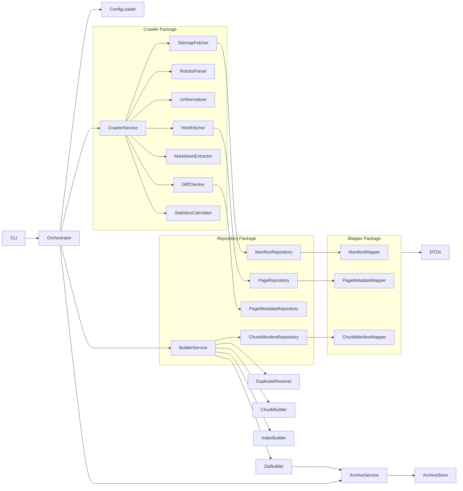

### 04_モジュール設計 v0.2（統合版）

---

### 1 目的

本設計書は **NotebookLM Document Crawler** のモジュール構成を定義し、実装者間で一貫した責務分離とインターフェースを保証することを目的とする。Docker Compose 環境で動作するバッチ型 Python アプリケーションとして、保守性、テスト容易性、差分処理の堅牢性を重視した設計を提供する。

---

### 2 設計原則と方針

**設計原則**

- **Single Responsibility** 1モジュール1責務を厳守する。  
- **Class Based** 主要機能はクラスで実装し状態管理を明確にする。  
- **DTO Only** モジュール間のデータ受け渡しは DTO のみとする。  
- **Repository for JSON** JSON ファイルへのアクセスは Repository 層に集約する。  
- **Mapper for Conversion** Mapper は JSON と DTO の相互変換のみを担当する。  
- **ConfigLoader Single Source** CLI 引数、環境変数、デフォルト値を統合して型検証済みの ConfigRecord を生成する。  
- **Service Orchestration Only** Service 層はオーケストレーションのみを担当する。  
- **Repository Concrete** Repository は抽象化せず JSON 専用実装とする。  
- **Builder Split** Builder は責務ごとに分割する。  
- **Logging Standard** 各モジュールは `logging.getLogger(__name__)` を使用する。  
- **Mermaid Diagrams** 依存関係図とクラス図を Mermaid で記述する。  
- **Config Type Validation** ConfigLoader は型変換と妥当性検証を行う。  
- **Statistics in Crawler** ページ統計は Crawler 配下の StatisticsCalculator が担当する。

---

### 3 全体構成とパッケージレイアウト

**高レベル依存関係**

- CLI → Orchestrator → ConfigLoader / CrawlerService / BuilderService / ArchiveService  
- CrawlerService → SitemapFetcher, RobotsParser, UrlNormalizer, HtmlFetcher, MarkdownExtractor, DiffChecker, StatisticsCalculator  
- Repository は ManifestRepository, PageRepository, PageMetadataRepository, ChunkManifestRepository  
- Mapper は ManifestMapper, PageMetadataMapper, ChunkManifestMapper  
- Builder は DuplicateResolver, ChunkBuilder, IndexBuilder, ZipBuilder

**パッケージ構成**

```
src/
├── cli/
├── config/
├── service/
├── crawler/
├── repository/
├── mapper/
├── dto/
├── builder/
├── archive/
├── utils/
└── exceptions/
```

**各パッケージ責務**

- **cli** CLI 引数解析とエントリポイント  
- **config** ConfigLoader と ConfigRecord 定義、型検証  
- **service** 高レベルのオーケストレーションクラス  
- **crawler** サイト探索、ページ取得、本文抽出、差分判定、ページ統計  
- **repository** JSON 読込保存を担う具体実装群  
- **mapper** JSON ⇔ DTO 変換のみを担当する変換器群  
- **dto** DTO 定義（dataclass）  
- **builder** Markdown 結合、チャンク化、インデックス生成、重複解決、ZIP 生成の起点  
- **archive** ZIP 生成とアーカイブ保存のユーティリティ  
- **utils** 共通ユーティリティ関数と小型ヘルパー  
- **exceptions** ドメイン例外定義

---

### 4 モジュール詳細（主要モジュールの責務と公開 API）

#### 共通ルール
- **ログ取得**：`logger = logging.getLogger(__name__)` を使用する。  
- **型注釈**：公開 API に型注釈を付与する。  
- **DTO**：`@dataclass(frozen=True)` を推奨する。  
- **例外**：低レベル例外はドメイン例外でラップする。  
- **テスト**：外部 I/O はモック可能に実装する。  

#### CLI
- **責務**：引数解析と Orchestrator 起動  
- **API**：`def main(argv: Optional[List[str]] = None) -> int`  
- **例外**：`ConfigError` をキャッチして非0終了

#### ConfigLoader
- **責務**：CLI 引数、環境変数、デフォルト値を統合し型検証済み ConfigRecord を生成する  
- **フロー**：CLI → Environment → 型変換 → Enum 検証 → デフォルト補完 → ConfigRecord 生成  
- **API**：`class ConfigLoader: def load_config(self, args: argparse.Namespace) -> ConfigRecord`  
- **例外**：`ConfigError`（必須項目欠落、型不正、enum不正）

#### Orchestrator
- **責務**：高レベル実行フロー制御（Crawler → Builder → Archive）  
- **API**：`class Orchestrator: def run(self, config: ConfigRecord) -> int`  
- **挙動**：例外はログ化して可能な限り部分成果物を保持し終了コードを返す

#### Crawler パッケージ（サブモジュール）
- **方針**：各サブモジュールは単一責務で DTO を返す

**SitemapFetcher**
- **API**：`fetch(base_url: str, config: ConfigRecord) -> list[str]`  
- **備考**：sitemap の lastmod をメタ情報として扱うオプションを持つ

**RobotsParser**
- **API**：`parse(base_url: str, config: ConfigRecord) -> RobotsInfo`  
- **備考**：User-Agent 判定に ConfigRecord.USER_AGENT を使用

**UrlNormalizer**
- **API**：`normalize(url: str) -> str`  
- **ルール**：フラグメント除去、末尾スラッシュ統一、utm_* 除去 等

**HtmlFetcher**
- **API**：`fetch(url: str, headers: Optional[Dict[str,str]] = None) -> HttpResponse`  
- **方針**：再試行は行わない。429 は Retry-After を参照して待機するが再試行は行わない

**MarkdownExtractor**
- **API**：`extract(html: str, url: str) -> Tuple[str, str]`  
- **方針**：trafilatura を用い、コードブロックを保持する。SPA はスキップ

**DiffChecker**
- **API**：`needs_fetch(url: str, http_response: HttpResponse, manifest_record: Optional[ManifestRecord]) -> DiffResult`  
- **判定順**：sitemap lastmod → If-Modified-Since/ETag → SHA256 比較

**StatisticsCalculator**
- **API**：`calculate(body_markdown: str) -> StatsRecord`  
- **方針**：tiktoken による推定トークン数を算出し生成物に目安である旨を明記する

#### Repository 実装群
- **方針**：JSON とキャッシュファイルの読み書きのみ。Mapper を利用して DTO ⇔ JSON を変換する

**ManifestRepository**
- **API**：`load(site: str) -> ManifestRecord`, `save(site: str, manifest: ManifestRecord) -> None`  
- **注意**：ファイルロックで並行競合を防止する

**PageRepository**
- **API**：`save_page(site: str, page: PageRecord) -> str`, `load_page(site: str, hash: str) -> PageRecord`  
- **注意**：保存時に SHA256 を検証する

**PageMetadataRepository**
- **API**：`upsert(site: str, metadata: ManifestRecordEntry) -> None`, `get(site: str, url: str) -> Optional[ManifestRecordEntry]`

**ChunkManifestRepository**
- **API**：`load(site: str) -> ChunkManifest`, `save(site: str, chunk_manifest: ChunkManifest) -> None`

#### Mapper 群
- **方針**：ファイル I/O を行わず JSON ⇔ DTO の変換のみを担当する

**ManifestMapper**
- **API**：`to_dto(json_obj: dict) -> ManifestRecord`, `to_json(manifest: ManifestRecord) -> dict`

**PageMetadataMapper**
- **API**：`to_dto(json_obj: dict) -> ManifestRecordEntry`, `to_json(entry: ManifestRecordEntry) -> dict`

**ChunkManifestMapper**
- **API**：`to_dto(json_obj: dict) -> ChunkManifest`, `to_json(chunk_manifest: ChunkManifest) -> dict`

#### DTO（主要 dataclass 例）
- **ConfigRecord**：base_urls, mode, word_limit, max_pages, request_delay, timeout_seconds, user_agent, include, exclude, log_level, log_format, log_file_path 等  
- **PageRecord**：url, title, body_markdown, sha256, etag, last_modified, downloaded_at, word_count, char_count, token_estimate  
- **ManifestRecord / ManifestRecordEntry**：ページメタ情報とダウンロード履歴、docs_filename, duplicate フラグ  
- **ChunkRecord**：docs_filename, pages, word_count  
- **StatsRecord**：word_count, char_count, token_estimate

#### Builder 群
- **DuplicateResolver**：本文 SHA256 による重複判定。重複時は後から見つかった URL を優先  
- **ChunkBuilder**：WORD_LIMIT に従いページ単位で docs_XXX.md を生成。1ページが上限を超える場合は単独ファイルとして警告  
- **IndexBuilder**：Index.md を生成。並び順は sitemap 順を優先し未定義は URL 順  
- **ZipBuilder**：output を ZIP 化し archives に保存。ユニーク名を付与し上書きしない

#### Archive パッケージ
- **ArchiveStore**：ZIP 作成の低レベル処理とアーカイブ保存先管理。履歴列挙と削除機能を提供

#### Utils
- **http**：timeout, headers, delay を適用する HTTP wrapper。再試行は行わない  
- **hash**：SHA256 計算ユーティリティ  
- **time**：ISO8601 変換、タイムスタンプ生成  
- **logger**：`setup_logging(config: ConfigRecord)` で global logging を初期化する

#### Exceptions
- `CrawlerError`, `ConfigError`, `RepositoryError`, `BuilderError`, `IOErrorCustom` を定義し上位で一元ハンドリングする

---

### 5 生成物、運用ノート、テスト方針

**生成物一覧**

- `cache/{site}/pages/{hash}.md`  
- `cache/{site}/manifest.json`  
- `output/{site}/docs_XXX.md`（複数）  
- `output/{site}/Index.md`  
- `output/{site}/chunk_manifest.json`  
- `archives/{site}/{site}_docs_YYYYMMDD_HHMMSS.zip`  
- `logs/crawler.log`

各生成物は先頭に生成メタデータを付与すること。生成メタデータは Generated by, Generated At, Source, Mode を含む。

**運用ノート**

- **依存管理**：`pyproject.toml` で開発依存を管理し `requirements.txt`（ピン済）を Docker ビルドで使用するハイブリッド運用を推奨する  
- **Config 運用**：Docker Compose では `.env` を環境変数として渡す前提。ConfigLoader は環境変数を優先して読む  
- **ログローテーション**：`RotatingFileHandler` を設定する  
- **セキュリティ**：ページ本文は実行しない。HTML 内スクリプトは無視する

**テスト方針**

- Crawler サブモジュールは HTTP をモックしてユニットテストを実施する  
- Repository は一時ディレクトリを用いた統合テストを実施する  
- Mapper は JSON スキーマ境界値テストを実施する  
- Builder は WORD_LIMIT 境界、1ページ超過、重複除去ケースを網羅する  
- ConfigLoader は優先順位と型検証のテストを実施する

---

### 6 Mermaid 図（依存関係図とクラス図）

**依存関係図**



**クラス図（高レベル）**

```mermaid
classDiagram
  class ConfigLoader {
    +load_config(args: Namespace) ConfigRecord
  }
  class ConfigRecord {
    +base_urls: List[str]
    +mode: ModeEnum
    +word_limit: int
    +max_pages: int
    +request_delay: float
    +timeout_seconds: int
    +user_agent: str
    +include: List[str]
    +exclude: List[str]
    +log_level: LogLevelEnum
    +log_format: str
    +log_file_path: str
  }

  class Orchestrator {
    +run(config: ConfigRecord) int
  }

  class CrawlerService {
    +process_site(base_url: str, config: ConfigRecord) List~PageRecord~
  }
  class SitemapFetcher {
    +fetch(base_url: str, config: ConfigRecord) List~str~
  }
  class RobotsParser {
    +parse(base_url: str, config: ConfigRecord) RobotsInfo
  }
  class UrlNormalizer {
    +normalize(url: str) str
  }
  class HtmlFetcher {
    +fetch(url: str, headers: Optional[Dict]) HttpResponse
  }
  class MarkdownExtractor {
    +extract(html: str, url: str) Tuple~str,str~
  }
  class DiffChecker {
    +needs_fetch(url: str, http_response: HttpResponse, manifest: Optional~ManifestRecord~) DiffResult
  }
  class StatisticsCalculator {
    +calculate(body_markdown: str) StatsRecord
  }

  class PageRepository {
    +save_page(site: str, page: PageRecord) str
    +load_page(site: str, hash: str) PageRecord
  }
  class ManifestRepository {
    +load(site: str) ManifestRecord
    +save(site: str, manifest: ManifestRecord) None
  }
  class ChunkManifestRepository {
    +load(site: str) ChunkManifest
    +save(site: str, chunk_manifest: ChunkManifest) None
  }

  class ManifestMapper {
    +to_dto(json_obj: dict) ManifestRecord
    +to_json(manifest: ManifestRecord) dict
  }
  class PageMetadataMapper {
    +to_dto(json_obj: dict) ManifestRecordEntry
    +to_json(entry: ManifestRecordEntry) dict
  }
  class ChunkManifestMapper {
    +to_dto(json_obj: dict) ChunkManifest
    +to_json(chunk_manifest: ChunkManifest) dict
  }

  class PageRecord {
    +url: str
    +title: Optional[str]
    +body_markdown: str
    +sha256: str
    +etag: Optional[str]
    +last_modified: Optional[str]
    +downloaded_at: datetime
    +word_count: int
    +char_count: int
    +token_estimate: int
  }
  class ChunkBuilder {
    +build_chunks(pages: List~PageRecord~, config: ConfigRecord) List~ChunkRecord~
  }
  class DuplicateResolver {
    +resolve(pages: List~PageRecord~) Tuple~List~PageRecord~, List~ManifestRecordEntry~~
  }
  class IndexBuilder {
    +build_index(manifest: ManifestRecord) str
  }
  class ZipBuilder {
    +create_archive(site: str, files: List~str~) str
  }
  class ArchiveStore {
    +save(site: str, archive_path: str) None
    +list_archives(site: str) List~str~
  }

  ConfigLoader --> ConfigRecord
  Orchestrator --> ConfigLoader
  Orchestrator --> CrawlerService
  Orchestrator --> ChunkBuilder
  Orchestrator --> ZipBuilder

  CrawlerService --> SitemapFetcher
  CrawlerService --> RobotsParser
  CrawlerService --> UrlNormalizer
  CrawlerService --> HtmlFetcher
  CrawlerService --> MarkdownExtractor
  CrawlerService --> DiffChecker
  CrawlerService --> StatisticsCalculator

  HtmlFetcher --> PageRepository
  SitemapFetcher --> ManifestRepository
  ChunkBuilder --> ChunkManifestRepository

  ManifestRepository --> ManifestMapper
  PageRepository --> PageMetadataMapper
  ChunkManifestRepository --> ChunkManifestMapper

  ChunkBuilder --> DuplicateResolver
  ChunkBuilder --> IndexBuilder
  ZipBuilder --> ArchiveStore
```



