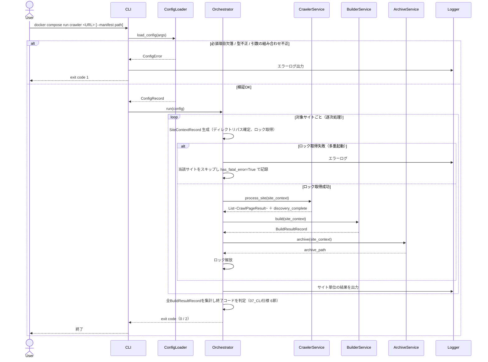
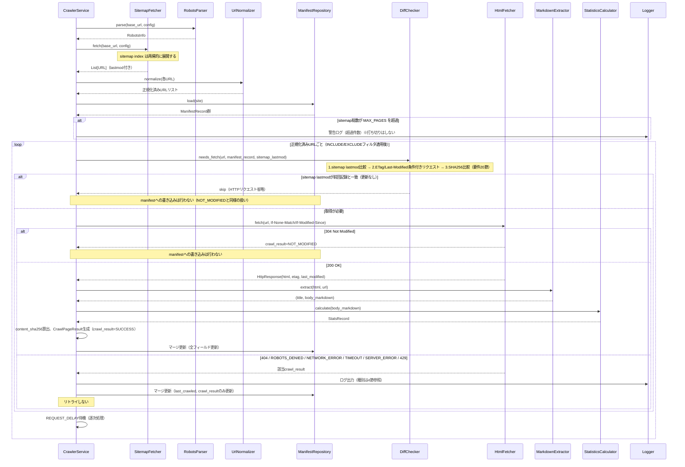
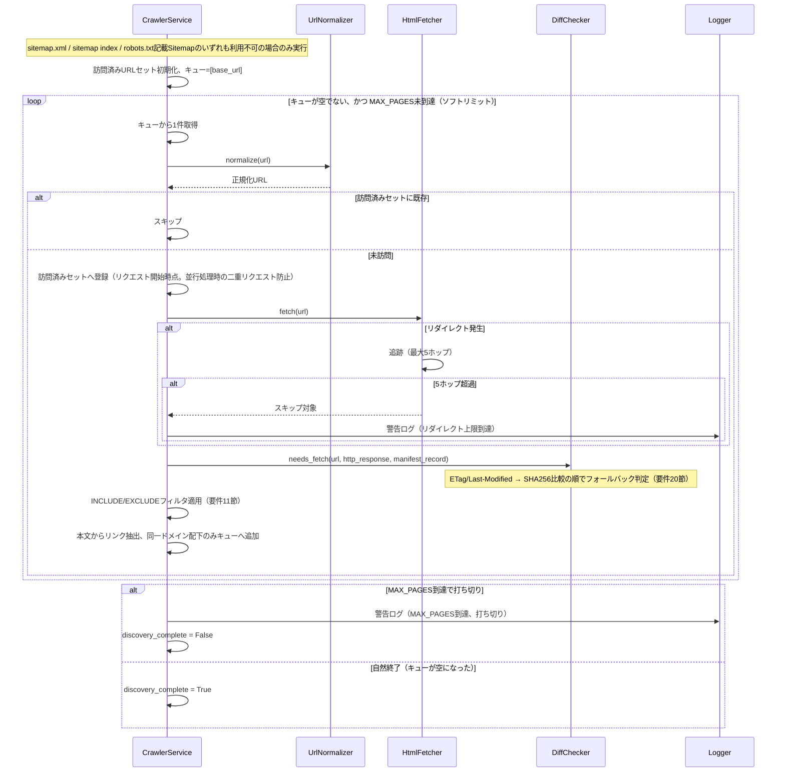
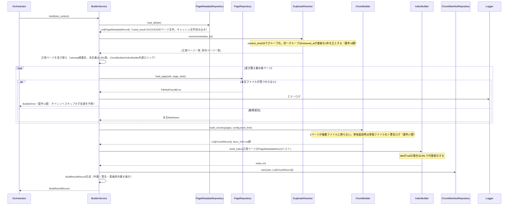
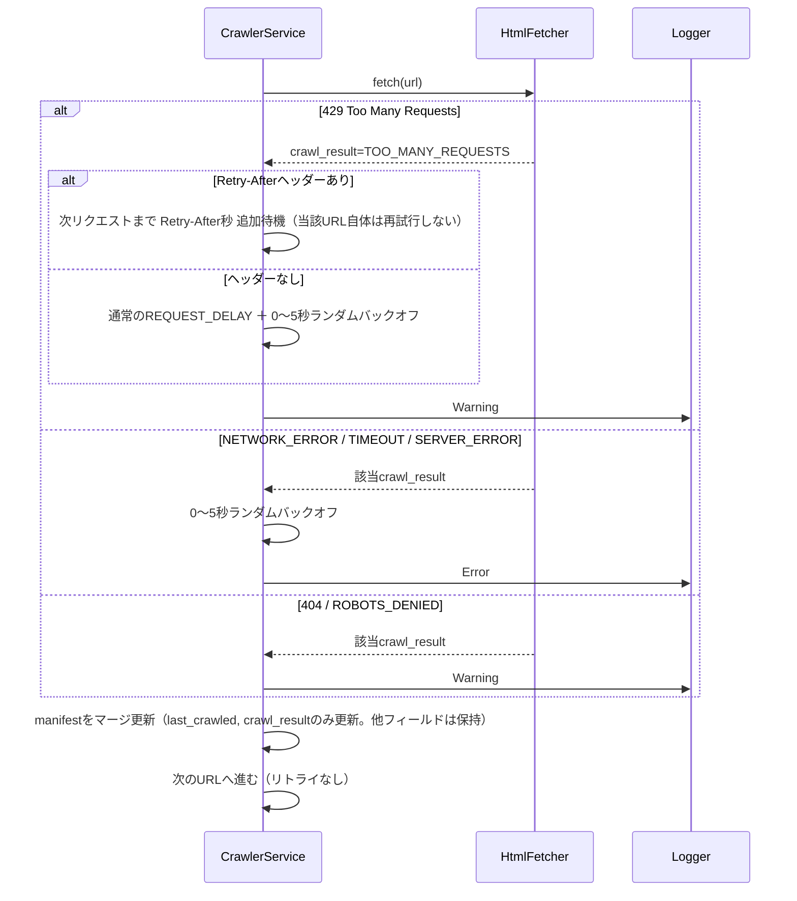
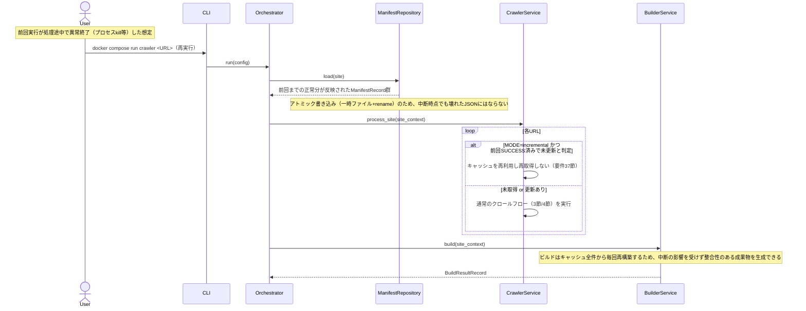

# 06_処理シーケンス

## 設計方針

- ページ取得は逐次処理とする。並列化は行わない。（要件定義書25節 `REQUEST_DELAY` の設計趣旨である「サーバー負荷軽減」を最優先するため。並列化はファイルロック・REQUEST_DELAYの意味付け・テスト方針全体に影響するアーキテクチャ上の決定であり、後からの変更は手戻りが大きい）
- 複数サイト処理もサイト単位で逐次処理とする。1サイトの処理（クロール→ビルド→アーカイブ）を完結させてから次のサイトへ進む。（要件定義書4節「サイトごとに独立して処理を行う」と整合し、あるサイトの障害が他サイトの成果物に影響しないようにするため）
- sitemap利用時、`MAX_PAGES` 超過は警告ログのみとし、sitemap記載分は全件処理する。同一ドメインクロール（フォールバック）時のみ `MAX_PAGES` 到達でクロールを打ち切る（ソフトリミット）。（要件定義書8節の記述を文言通りに適用。sitemapは探索範囲が有限かつ既知であり無限ループのリスクがないため、`MAX_PAGES` は本来フォールバッククロールの暴走防止が主目的と解釈する）
- `INCLUDE` が未設定の場合、対象URLのパス部分（ドメインルートを除く）を暗黙のINCLUDEとして自動適用する。（v1.0.1 Issue #6対応。sitemap利用時のクロールは常にドメインルートの`sitemap.xml`を参照するため、`INCLUDE`未設定のままだと `https://example.com/docs/guides` のようにパスを指定したつもりでも `/blog/` 等ドメイン全体が対象になってしまう問題があった。`INCLUDE`を明示的に指定した場合は常にその指定を優先し、既存のCLI利用者の挙動を変えない）
- 削除ページ判定は、探索が「網羅的」に完了した場合のみ実行する。`MAX_PAGES` 到達によるフォールバッククロール打ち切り時、および現在のINCLUDE/EXCLUDEフィルタが前回実行時と異なる場合は、削除判定を抑制する。（探索が及んでいない・対象外になっただけのページを「サイトから削除された」と誤判定し、キャッシュをサイレントに失うことを防ぐため）
- サイト単位の致命的なクロール失敗（新規ページが1件も取得できない等）が発生しても、ビルド・アーカイブ工程は必ず実行する。（要件定義書15節「ビルドは常にキャッシュ全件から再構築する」という方針と整合させるため。ただし成果物が0件の場合は警告ログを出力する）
- sitemapのlastmod比較により更新なしと判定しHTTPリクエストを省略した場合、manifest.jsonへの書き込みは行わない。（「05_データ構造設計」で定義された `NOT_MODIFIED`（304）の扱いと同様に扱う。`CrawlResult` 列挙体に専用の値を追加しないことで、05で確定済みのスキーマとの一貫性を保つ）
- JSON書き込み（`manifest.json` / `metadata/*.json` / `chunk_manifest.json`）は一時ファイル書き込み＋rename によるアトミック書き込みとする。（要件定義書37節のレジューム可能性を担保し、異常終了時に壊れたJSONファイルが残ることを防ぐため）
- サイト単位でロックファイルを作成し、多重起動を防止する。ロック取得に失敗した場合は待機せず即座にエラー終了する。（要件にキュー化の言及がなく、即時失敗とする方がシンプルで運用上分かりやすいため）
- `ChunkBuilder` と `IndexBuilder` は共通のページ並び替えロジック（sitemap順優先、未定義はURL順）を使用する。（`docs_XXX.md` と `Index.md` の並び順が一致しないと、NotebookLM利用者がドキュメントを参照しづらくなるため）

---

## 1. DTO整合性に関する補足（04→05読み替え）

「04_モジュール設計」と「05_データ構造設計」の間には、DTOの命名・構造の不整合が存在する。本書（および「07_CLI仕様」「02_基本設計書」）では **05を正** とし、以下の通り読み替える。04自体の修正は行わない。

| 04の記述 | 05との不整合点 | 06/07/02での扱い |
|---|---|---|
| `PageRecord`（`body_markdown` ・ `etag` ・ `last_modified` ・ `downloaded_at` ・ `token_estimate` を1つのDTOに内包） | 05は本文とメタデータを分離管理する方針（`PageMetadataRecord` に本文なし。`etag`/`last_modified` は `ManifestRecord` 側が保持） | `PageRecord` という名称は用いない。クロール結果を表す**永続化しないプロセス内一時オブジェクト**として `CrawlPageResult` を新設し、そこから `ManifestRecord` 更新分・`PageMetadataRecord`・本文Markdownの3つを切り出してそれぞれの保存先へ書き込む（後述） |
| `PageMetadataRepository.upsert(site, metadata: ManifestRecordEntry)` | `ManifestRecordEntry` という型は05に存在しない | `PageMetadataRepository` は `metadata/{page_hash}.json`（`PageMetadataRecord`）の読み書きを担当するRepositoryとして再定義する。manifest.json自体は引き続き `ManifestRepository` が担当する |
| `ManifestRecord` に `docs_filename` ・ `duplicate` フラグを含む | 05の確定スキーマ（7フィールド）にはどちらも存在しない。05は重複フラグをmanifestから意図的に排除している | 05のスキーマを正とする。`docs_filename` の対応関係は `chunk_manifest.json`（`ChunkRecord`）側で管理する |
| `ChunkManifestRepository.load/save(..., chunk_manifest: ChunkManifest)` | `ChunkManifest` という包括型は05に存在しない（05は `ChunkRecord` のリストとして表現） | `ChunkManifestRepository` は `List[ChunkRecord]` を読み書きするRepositoryとして扱う |
| `IndexBuilder.build_index(manifest: ManifestRecord) -> str` | 05ではタイトル等のビルド用情報はmanifestになく、`PageMetadataRecord` 側にのみ存在する | `IndexBuilder.build_index(metadata_list: List[PageMetadataRecord]) -> str` に読み替える |
| `BuildResultRecord` / `SiteContextRecord` | 04・05ともにフィールド未定義 | 本書で新規に定義する（下記1.1） |

### 1.1 新規DTO定義

```python
@dataclass(frozen=True)
class SiteContextRecord:
    site_identifier: str
    base_url: str
    cache_dir: Path
    output_dir: Path
    archive_dir: Path
    manifest_path: Path        # --manifest指定時は上書き。それ以外は cache_dir/manifest.json
    config: ConfigRecord
    started_at: datetime
```

```python
@dataclass(frozen=True)
class BuildResultRecord:
    site_identifier: str
    total_pages_included: int       # 結合Markdown・Index.mdに含まれたページ数
    duplicate_excluded_count: int   # 重複により除外されたページ数
    chunk_file_count: int           # 生成された docs_XXX.md の数
    total_word_count: int
    warnings: List[str]
    has_fatal_error: bool           # True の場合、Orchestratorは当該サイトを「部分的失敗」として扱う（07_CLI仕様 6節）
    archive_path: Optional[str]
```

```python
@dataclass(frozen=True)
class CrawlPageResult:
    """クロール結果を表す一時オブジェクト。永続化されない。"""
    url: str
    page_hash: str
    crawl_result: CrawlResult
    etag: Optional[str]
    last_modified: Optional[str]
    sitemap_lastmod: Optional[str]
    body_markdown: Optional[str]    # crawl_result=SUCCESS の場合のみ値を持つ
    title: Optional[str]
    language: Optional[str]
    content_type: Optional[str]
    stats: Optional[StatsRecord]    # word_count, char_count, token_count
    content_sha256: Optional[str]
    retrieved_at: datetime
```

`CrawlPageResult` は `CrawlerService` 内部でのみ使用され、`crawl_result == SUCCESS` の場合に限り `PageRepository`（本文）・`PageMetadataRepository`（メタデータ）への書き込みが行われる。`crawl_result` の値に関わらず、`ManifestRepository` へはマージ更新ルール（05参照）に従って反映される。

---

## 2. 全体フロー（起動〜終了）



---

## 3. サイトマップ利用時のクロール（差分判定含む）



---

## 4. フォールバック（同一ドメインクロール）



---

## 5. ビルド処理



---

## 6. エラー・スキップ処理



---

## 7. Resume（中断後再実行）



---

## 8. 削除ページ判定ロジック（網羅性ガード）

削除ページ判定（要件定義書23節）は、以下の条件を**すべて**満たした場合のみ実行する。条件を満たさない場合は判定そのものをスキップし、警告ログを出力する。

| 条件 | 説明 |
|---|---|
| ① 探索が網羅的に完了している（`discovery_complete = True`） | sitemap利用時：常に `True`（sitemapはMAX_PAGES超過時も全件処理するため）。フォールバッククロール時：MAX_PAGESに到達せずキューが自然に空になった場合のみ `True` |
| ② 比較対象を現在のINCLUDE/EXCLUDEフィルタに一致するURLに限定する | 前回manifestに記録されているが現在のフィルタでは対象外となったURLは、削除候補から除外する |

判定ロジック（疑似コード）：

```text
if discovery_complete == False:
    log.warning("探索が完了していないため削除判定をスキップしました")
    return  # manifestからの削除は行わない

対象 = {前回manifestのURL} ∩ {現在のINCLUDE/EXCLUDEフィルタに一致するURL}
削除候補 = 対象 - {今回発見されたURL}

for url in 削除候補:
    manifestから当該URLのレコードを削除
    log.info(f"Deleted: {url}")
```

> 「引き続き発見されるが取得すると404/ROBOTS_DENIEDを返すURL」は本ロジックの対象外であり、「05_データ構造設計」の定義通りmanifestに保持される（次回も再試行する）。本ロジックが扱うのは「そもそも発見されなくなったURL」のみである。

---

## 9. ファイルロック・アトミック書き込み仕様

### アトミック書き込み

- `manifest.json` / `metadata/{page_hash}.json` / `chunk_manifest.json` の保存は、同一ディレクトリ内に一時ファイルを作成して書き込んだ後、`os.replace`（rename）で本来のファイル名に置き換える方式とする。
- これにより、書き込み途中でプロセスが異常終了しても、既存ファイルが破損した状態で残ることはない。

### ファイルロック

- サイトごとに `cache/{site_identifier}/.lock` を作成し、処理開始時に排他ロックを取得する。
- ロック取得に失敗した場合（同一サイトに対する多重起動）、待機せず即座にエラーとし、当該サイトを `has_fatal_error=True` として記録する（全体ジョブは継続し、他サイトの処理は続行する）。
- 処理完了後（正常終了・異常終了を問わず）、ロックを解放する。

---

## 補足

- 本書のシーケンス図は「04_モジュール設計」のクラス図・依存関係図に対応するコンポーネント名を用いている。DTOの扱いは1節の読み替えに従う。
- 本書で新たに定義した `SiteContextRecord` ・ `BuildResultRecord` ・ `CrawlPageResult` は、実装時に `dto/` パッケージへ配置することを想定する（`SiteContextRecord` は05のDTO配置一覧にある `site_context_record.py` に対応。`CrawlPageResult` は永続化対象ではないため、配置先は実装時に別途検討する）。
- 終了コードとの対応関係（`BuildResultRecord.has_fatal_error` の集計方法）は「07_CLI仕様」6節を参照。
