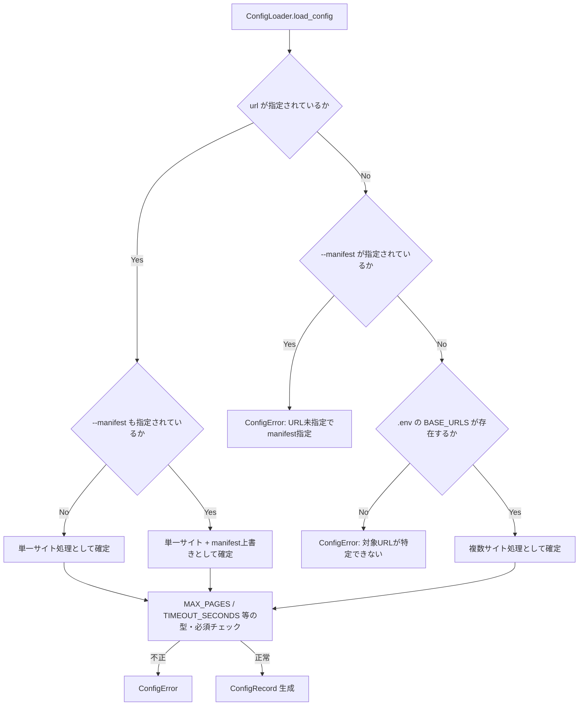

# 07_CLI仕様

## 設計方針

- CLI引数は要件定義書36節で定義された範囲（URL・`--manifest`）を基本とし、運用補助のための非機能フラグ（`--log-level`等）のみ最小限追加する。（要件で明示されていない設定変更手段を増やし、仕様が際限なく拡張されることを防ぐため）
- 終了コードは3段階（成功／致命的エラー／部分的失敗）とする。（cron等での自動監視において、即時対応が必要な障害と経過観察でよい警告を区別できるようにするため）
- 「複数サイト処理時」の判定は、URLの件数ではなく `.env` の `BASE_URLS` 経由で処理されているかどうかという**経路**で行う。（`.env` の書き換えだけで `--manifest` の可否が変わる事態を避け、挙動を予測しやすくするため）
- `--manifest` はmanifest.jsonの保存先のみを上書きする。`cache/{site}/pages/` ・ `cache/{site}/metadata/` は常に標準ディレクトリ構成（「03_ディレクトリ構成」準拠）を用いる。（キャッシュ構成全体の一貫性を保つため）
- ログはコンソール（標準出力）とファイル（`logs/crawler.log`）の両方に同一内容を出力する。（`docker compose up` 実行中にリアルタイムで状況を把握できるようにするため）
- `LOG_LEVEL` / `LOG_FORMAT` / `LOG_FILE_PATH` を `.env` の正式項目として追加する。（「04_モジュール設計」の `ConfigRecord` ・ `setup_logging` が前提とする項目であり、要件定義書36節の設定一覧に明記がないままでは実装者が迷うため）

---

## 1. 起動方法

### 1.1 単一サイト処理

```bash
docker compose run crawler https://react.dev
```

CLI引数でURLを指定した場合、`.env` の `BASE_URLS` は読み込まれず、指定された1サイトのみを処理する（要件定義書5節）。

### 1.2 manifest保存先の指定（単一サイト処理時のみ）

```bash
docker compose run crawler https://react.dev --manifest ./manifest-prod.json
```

- `--manifest` は単一サイト処理を前提とするオプションである。
- 指定された場合、`cache/{site_identifier}/manifest.json` の代わりに指定パスを使用する。
- `cache/{site_identifier}/pages/` ・ `cache/{site_identifier}/metadata/` の参照先は変更されない。

### 1.3 複数サイト処理（`.env` の `BASE_URLS`）

```bash
docker compose up
```

CLI引数でURLを指定しない場合、`.env` の `BASE_URLS` を読み込み、記載された複数サイトを**サイトごとに逐次処理する**（「06_処理シーケンス」参照）。

---

## 2. CLI引数仕様

| 引数 | 形式 | 必須 | 説明 |
|---|---|---|---|
| `url` | 位置引数 | 任意 | 単一サイト処理時の対象URL。省略時は `.env` の `BASE_URLS` を使用する |
| `--manifest <path>` | オプション | 任意 | manifest.jsonの保存先パスを上書きする。`url` 省略時（複数サイト処理時）に指定するとエラー（4節参照） |
| `--log-level <LEVEL>` | オプション | 任意 | `.env` の `LOG_LEVEL` を一時的に上書きする（`DEBUG`/`INFO`/`WARNING`/`ERROR`）。トラブルシュート用途 |
| `--help` / `-h` | オプション | - | 使用方法を表示し終了する（終了コード0） |
| `--version` | オプション | - | バージョン文字列を表示し終了する（終了コード0） |

> `--log-level` 以外の `.env` 項目（`MODE` / `WORD_LIMIT` / `REQUEST_DELAY` 等）はCLIから変更できない。要件定義書36節「CLIから変更可能な項目」の範囲を維持するための意図的な制限である。

---

## 3. 環境変数（`.env`）仕様

| 変数名 | 説明 | デフォルト | 未定義時 |
|---|---|---|---|
| `BASE_URLS` | 複数サイトURL（改行区切り） | なし | CLI引数指定があればスキップ。両方未指定はConfigError |
| `MODE` | `incremental` / `full` | `incremental` | デフォルト適用 |
| `WORD_LIMIT` | 結合Markdown1ファイルあたりの語数上限 | `450000` | デフォルト適用 |
| `REQUEST_DELAY` | リクエスト間の待機秒数 | `0.5` | デフォルト適用 |
| `USER_AGENT` | HTTPアクセス時のUser-Agent | `NotebookLM-Crawler/1.0` | デフォルト適用 |
| `INCLUDE` | 取得対象パス | なし | 未設定時は、対象URLのパス部分を暗黙のINCLUDEとして扱う（下記補足参照） |
| `EXCLUDE` | 除外対象パス | なし | デフォルト適用（制限なし） |
| `MAX_PAGES` | 同一ドメインクロール時の最大ページ数（ソフトリミット）／sitemap利用時は警告閾値 | `1000` | **ConfigError** |
| `TIMEOUT_SECONDS` | HTTPタイムアウト秒数 | `30` | **ConfigError** |
| `LOG_LEVEL` | ログレベル（`DEBUG`/`INFO`/`WARNING`/`ERROR`） | `INFO` | デフォルト適用 |
| `LOG_FORMAT` | ログフォーマット（`text` / `json`） | `text` | デフォルト適用 |
| `LOG_FILE_PATH` | ログファイル出力先 | `logs/crawler.log` | デフォルト適用 |

> `BASE_URL`（単数）は `.env` では使用しない。単一サイト指定はCLI引数（位置引数 `url`）でのみ行う（要件定義書3節）。

> **`INCLUDE`未設定時の暗黙スコープについて（v1.0.1以降）**：対象URLがドメインルート以外のパスを含む場合（例：`https://example.com/docs/guides`）、`INCLUDE`が明示的に指定されていなければ、そのパス部分（`/docs/guides`）を暗黙のINCLUDEとして自動適用する。これは、sitemap利用時のクロールが常にドメインルートの`sitemap.xml`を読みに行く仕様（06_処理シーケンス.md 3節）であるため、`INCLUDE`未設定のままだと指定パス外（例：`/blog/`）まで取得対象になってしまう不具合の修正として導入した（Issue #6）。`INCLUDE`を明示的に指定した場合は、常にその指定が優先される。

---

## 4. 設定の優先順位

```
CLI引数 > .env（環境変数） > デフォルト値
```

- `url` ・ `--manifest` ・ `--log-level` はCLI引数専用、または `.env` 値の一時的な上書きとして扱う。
- それ以外の項目は `.env` またはデフォルト値から決定し、実行中の上書きはできない。

---

## 5. 引数バリデーションとエラー



| 状況 | 判定 | 終了コード | メッセージ例 |
|---|---|---|---|
| URL未指定で `--manifest` のみ指定 | ConfigError | 1 | `URL is required when --manifest is specified.` |
| 複数サイト処理時（`url` 省略・`BASE_URLS` 経由）に `--manifest` を指定 | ConfigError | 1 | `--manifest is not allowed in multi-site mode (BASE_URLS).` |
| `url` も `BASE_URLS` も指定なし | ConfigError | 1 | `No target URL found. Specify a URL argument or set BASE_URLS in .env.` |
| `MAX_PAGES` / `TIMEOUT_SECONDS` が `.env` に未定義 | ConfigError | 1 | `MAX_PAGES is required but not set in .env.` |
| `MODE` が `incremental` / `full` 以外 | ConfigError | 1 | `Invalid MODE: <value>. Expected "incremental" or "full".` |
| `url` の形式が不正（スキームなし等） | ConfigError | 1 | `Invalid URL: <value>` |

---

## 6. 終了コード仕様

| コード | 意味 | 発生条件 |
|---|---|---|
| `0` | 正常終了 | 全サイトの処理が完了し、致命的エラー・サイト単位の失敗がない（個別ページのスキップ・警告は許容） |
| `1` | 致命的エラー（未実行） | `ConfigError` 等によりジョブが開始できなかった場合 |
| `2` | 部分的失敗 | ジョブ全体は完了したが、1つ以上のサイトで致命的なサイト単位エラーが発生した場合（例：クロール・ビルドの双方が失敗し成果物が更新できなかった場合） |

> ページ単位のエラー（`NOT_FOUND` / `NETWORK_ERROR` / `TIMEOUT` / `SERVER_ERROR` / `TOO_MANY_REQUESTS` / `ROBOTS_DENIED`）は要件定義書25節の通り想定内の挙動であり、これ単体では終了コードを `2` にしない。`crawler.log` への記録のみ行う。
> 終了コードの判定方法の詳細（`BuildResultRecord` の集計方法）は「06_処理シーケンス」で定義する。

---

## 7. ログ出力仕様

- 出力先：コンソール（標準出力）と `logs/crawler.log`（追記、`RotatingFileHandler`）の両方に同一内容を出力する。
- ログレベルは `.env` の `LOG_LEVEL`（またはCLIの `--log-level`）に従う。
- フォーマット例（`LOG_FORMAT=text` の場合）：

```
2026-06-30T21:30:45+09:00 [INFO] CrawlerService: Downloaded https://react.dev/learn (sha256=...)
2026-06-30T21:31:10+09:00 [WARNING] CrawlerService: MAX_PAGES reached. Fallback crawl truncated at 1000 pages.
2026-06-30T21:31:12+09:00 [ERROR] HtmlFetcher: TIMEOUT https://react.dev/blog/old-post
```

- ログ種別は要件定義書24節の分類（Downloaded / Updated / Skipped / Deleted / Duplicate / Error / Warning）に従う。

---

## 8. ヘルプ表示（`--help` 出力例）

```
usage: crawler [url] [--manifest PATH] [--log-level LEVEL] [--help] [--version]

NotebookLM Document Crawler

positional arguments:
  url                   単一サイト処理時の対象URL（省略時は .env の BASE_URLS を使用）

options:
  --manifest PATH       manifest.json の保存先を上書きする（単一サイト処理時のみ）
  --log-level LEVEL     ログレベルを一時的に上書きする（DEBUG/INFO/WARNING/ERROR）
  -h, --help            このヘルプを表示して終了する
  --version             バージョンを表示して終了する

examples:
  docker compose run crawler https://react.dev
  docker compose run crawler https://react.dev --manifest ./manifest-prod.json
  docker compose up
```

---

## 9. 使用例一覧

| 目的 | コマンド |
|---|---|
| 単一サイト処理 | `docker compose run crawler https://react.dev` |
| manifest保存先を変更して単一サイト処理 | `docker compose run crawler https://react.dev --manifest ./manifest.json` |
| 複数サイト処理（`.env` の `BASE_URLS`） | `docker compose up` |
| ログレベルを一時的に変更 | `docker compose run crawler https://react.dev --log-level DEBUG` |

---

## 補足

- 本書で定義したCLI引数・環境変数・終了コードは「04_モジュール設計」の `CLI` / `ConfigLoader` / `ConfigRecord` の実装仕様と整合させる。
- `BuildResultRecord` を用いた終了コード判定の具体的な処理シーケンスは「06_処理シーケンス」で定義する。
- 本書はCLIの外部仕様（入出力インターフェース）のみを定義し、内部処理の詳細は「04_モジュール設計」「06_処理シーケンス」に委ねる。
